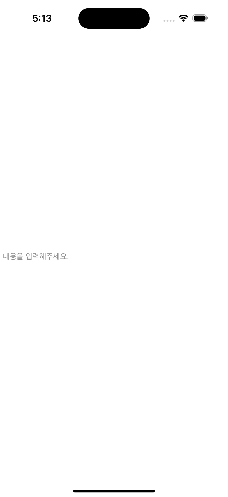
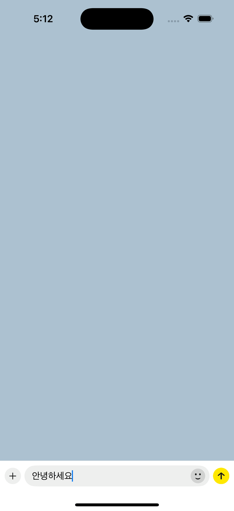

# DynamicTextEditor

`DynamicTextEditor` は、ユーザーの入力に応じて自動的に高さが調整される SwiftUI ベースの `TextEditor` コンポーネントです。  

> カカオトークのチャット入力欄のように、入力行数に合わせて動的に高さが変わります。

---

## Language
🇰🇷 [한국어 README](README_KR.md) | 🇺🇸 [English README](README.md) | 🇯🇵 [日本語 README](README_JP.md)

## ✨ 特徴

- ✅ 最大行数を設定可能  
- ✅ プレースホルダーテキスト対応  
- ✅ 自動で高さが変わる `TextEditor`  
- ✅ カスタムフォント対応  

---

## 🛠 必要条件

- iOS 15+  
- SwiftUI  

---

## 📦 インストール

### Swift Package Manager (SPM)

```swift
dependencies: [
    .package(url: "https://github.com/winwx/DynamicTextEditor.git", branch: "main")
]
```

---

## 🚀 使用方法

### 基本的な例
```swift
import SwiftUI
import DynamicTextEditor

@State var text: String = ""

var body: some View {
    DynamicTextEditor("テキストを入力してください...", text: $text)
}
```

  

### カカオトーク風クローン例
```swift
import SwiftUI
import DynamicTextEditor

@State var text: String = ""

var body: some View {
    ...
    HStack(alignment: .bottom, spacing: 16) {
        DynamicTextEditor(
            "メッセージを入力",
            text: $text
        )
        .setFont(uiFont: .systemFont(ofSize: 16))
        .setMaxLineCount(8)
        .setTextColor(.black)
        .setPlaceholderColor(.gray)
        .frame(minHeight: 24)

        emojiButton()
    }
    .padding(.vertical, 6)
    .padding(.horizontal, 8)
    .background(Color.textField_BG)
    .cornerRadius(20)
    ...
}
```

  

---

## 🎛 モディファイア API

DynamicTextEditor は、SwiftUI スタイルのモディファイア API を提供し、動作や見た目をカスタマイズできます。  

### 🔤 `setFont(uiFont:)`

`UIFont` を使ってフォントを設定します。

```swift
DynamicTextEditor("入力", text: $text)
    .setFont(uiFont: .systemFont(ofSize: 16, weight: .medium))
```

### 📏 `setMaxLineCount(_:)`

最大行数を設定します。デフォルトは **5** です。

```swift
DynamicTextEditor("入力", text: $text)
    .setMaxLineCount(3)
```

### 🎨 `setTextColor(_:)`

テキストの色を設定します。デフォルトは `.black` です。

```swift
DynamicTextEditor("入力", text: $text)
    .setTextColor(.gray)
```

### 👤 `setPlaceholderColor(_:)`

プレースホルダーの色を設定します。デフォルトは `.gray` です。

```swift
DynamicTextEditor("入力", text: $text)
    .setPlaceholderColor(.black)
```

---

🧪 カスタム例

```swift
DynamicTextEditor("コメントを入力してください...", text: $text)
    .setFont(uiFont: .systemFont(ofSize: 14))
    .setMaxLineCount(4)
    .setTextColor(.blue)
    .setPlaceholderColor(.red)
```
